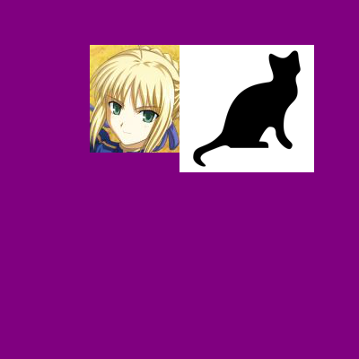
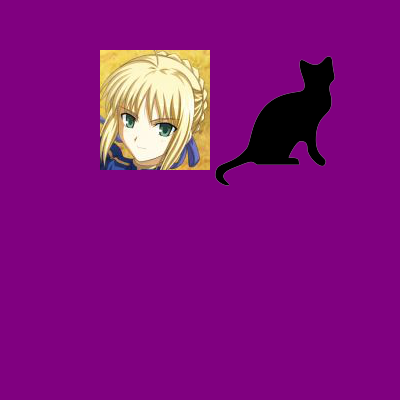

# Pillow to deal with image

## 0. install

`pip install pillow`

## 2. basic usage

```python
from PIL import Image

ImageColor.getcolor('red', 'RGBA') # (255, 0, 0, 255)
ImageColor.getcolor('chocolate', 'RGBA') # (210, 105, 30, 255)

im: Image.Image = Image.open('./assets/saber.jpeg')
print(im.format, im.size, im.mode)

# create new image
imaNewPurple: Image.Image = Image.new(
    mode='RGBA', size=(400, 400), color="purple")
imaNewPurple.save('./assets/purple.png')
imaNewTransparent: Image.Image = Image.new(mode='RGBA', size=(100, 100))
imaNewTransparent.save('./assets/transparent.png')
```

## 3. resize/thumbnail img

```python
im: Image.Image = Image.open('./assets/saber.jpeg')
# create thumbnail
im.thumbnail((150, 100)) # create a thumbnail
im.save('./assets/saber_thumb.jpeg', 'png')

# reize img
width, height = imSaber2.size
quatersizedIm: Image.Image = imSaber2.resize((width//2, height//2))
quatersizedIm.save('./assets/saber2_resized.png')
```

Note:

-   `Image.resize` resizes to the dimensions you specify
-   `Image.thumbnail` resizes the the max input dimensions (width and height)

## 4. crop image

```python
# crop image
# Note it's left, upper, right, and lower pixel
imSaber2: Image.Image = Image.open('./assets/saber2.jpg')
imCrop = imSaber2.crop((200, 15, 310, 135))
imCrop.save('./assets/croppedSaber2.png')
```

Note:
- The crop box is `(left, top, right, bottom)`

## 5. copy paste image

```python
# copy paste image
imSaber2Crop: Image.Image = Image.open(
    './assets/saber2.jpg').crop((200, 15, 310, 135))
imageNewPurpleCopy = imaNewPurple.copy()
# paste to (100, 50), it's destImg.paste(srcImage, box)
imageNewPurpleCopy.paste(imSaber2Crop, (100, 50))

catlogo: Image.Image = Image.open('./assets/catlogo.png')
catlogo.thumbnail((150, 150))
imageNewPurpleCopy.paste(catlogo, (200, 50), catlogo)  # paste to (100, 50)

imageNewPurpleCopy.save('./assets/purpleCopy.png')  # must save!!
```

Note:
-   The `paste` method is `des.paste(src, desBox, mask)`
-   The third params `mask` is usefult when you want to create a logo. Check the difference here: 
Without mask:

with mask:



## 6. rotate and flip img

```python
# rotate and flip img
imSaber2: Image.Image = Image.open('./assets/saber2.jpg')
imSaber2.rotate(30).save('./assets/rotated30Sabaer2.png')
imSaber2.rotate(30, expand=True).save('./assets/rotated30ExpandSabaer2.png')
imSaber2.transpose(Image.FLIP_LEFT_RIGHT).save(
    './assets/flipHorizentalSaber2.png')
imSaber2.transpose(Image.FLIP_TOP_BOTTOM).save(
    './assets/flipVerticalSaber2.png')
```

Note:
-   The rotate method had an `expand` paramter. Default is false. If you set it to true, it will try to put the whole rotate img in your box. Without it, the rotate img may beyond the box area.


## 7. draw shape

```python
from PIL import ImageDraw

# draw shape
im = Image.new('RGBA', (200, 200), 'white')
draw = ImageDraw.Draw(im)
draw.line([(20, 20), (180, 20), (180, 180), (20, 180), (20, 20)], fill='black')
draw.rectangle((20, 30, 60, 60), fill='blue')
draw.ellipse((120, 30, 160, 60), outline='red')
draw.polygon(((57, 87), (79, 62), (94, 85), (120, 90), (103, 113)),
             fill='brown')
im.save('./assets/drawShape.png')
```

Note:

- use `fill` when you want to fill the area. Use `outline` when you just want to stroke the area.


## 8. draw Text

```python
from PIL import Image, ImageDraw, ImageFont

# Draw font
im = Image.new('RGBA', (200, 200))
draw = ImageDraw.Draw(im)
draw.text((20, 150), 'Hello', fill='purple')
FontFolder = '/Library/Fonts'
arialFont = ImageFont.truetype(os.path.join(FontFolder, 'arial.ttf'), 32)
draw.text((100, 150), 'Howdy', fill='gray', font=arialFont)
im.save('./assets/drawFont.png')
```

Note:
-   You need to specify the font directory if you want to set the font.
-   The font size is **not pixel, it's point**!