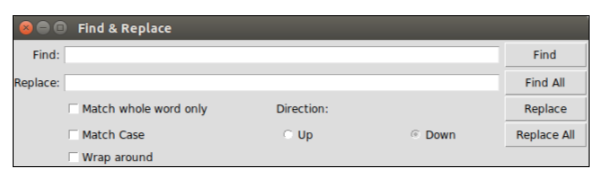

# tkinter

## 1. create a window

```python
import tkinter

# main window
win = tkinter.Tk()
win.title('tkinter title')

# set up window size newGeometry=widthxheight+x+y
win.geometry(newGeometry="400x400+1500+30")

win.mainloop()
```

## 2. label

```python
label = tkinter.Label(win, text="label content", width=20, heigh=10,
                      bg="pink", fg="red", font=("Inconsolata", 20), wraplength=50, justify="left", anchor="se")
label.pack()
```

Note:
-   The `width` and `height` is a little strange
-   `fg` is text color
-   `wraplength` is change line width

## 3. button

```python
# button
btn = tkinter.Button(win, text="按钮1", command=lambda: print(12345))
btn.pack()
```

Note:
-   You can also set `width` and `height` property

## 4. entry (input)

```python
# entry
tkVar = tkinter.Variable() # only bind this when you want to set the entry value
entry = tkinter.Entry(win, show="*", text=tkVar)
entry.pack()
tkVar.set('12345')
```

Note:

-   You need to bind a `tkinter.Variable()` to your entry when you want to set the entry value
-   You can use `entry.get()` or `tkinter.Variable().get()` to get the value of the entry

## 5. text (text area)

```python
# text (textArea)
text = tkinter.Text(win, width=30, height=4)
text.pack()
str1 = """THE PRESIDENT: Hello, everybody! Thank you. Thank you. Thank you, everybody. All right, everybody go ahead and have a seat. How is everybody doing today? (Applause.) How about Tim Spicer? (Applause.) I am here with students at Wakefield High School in Arlington, Virginia. And we've got students tuning in from all across America, from kindergarten through 12th grade. And I am just so glad that all could join us today. And I want to thank Wakefield for being such an outstanding host. Give yourselves a big round of applause. (Applause.) """

text.insert(tkinter.INSERT, str1)
```

Note:

-   If you want to have scroll bar for your text area. Then consider use `from tkinter.scrolledtext import ScrolledText`. ScrolledText has save initial value with Text.

## 6. spin box (like number input)

```python
# spin box (number input)
sp = tkinter.Spinbox(win, from_=5, to=60, increment=5)
sp.pack()

btn = tkinter.Button(win, text="spValue", command=lambda: print(sp.get()))
btn.pack()
```

## 7. list box

```python
listBoxVar = tkinter.Variable() # only bind this when you want to set or get all the list box value
listBox = tkinter.Listbox(
    win, selectmode=tkinter.EXTENDED, listvariable=listBoxVar) # There are also some other select mode, like tkinter.SINGLE or tkinter.BRWOSER
listBox.pack()

listBox.bind(
    '<Double-Button-1>', lambda event: print(listBox.get(listBox.curselection())))  # bind left moust button double click. 1 menas mouse left key

listBox.bind('<<ListboxSelect>>', lambda event: print(
    listBox.get(first=listBox.curselection()[0], last=listBox.curselection()[-1])))  # bind when select event

for item in ['awdw', 'eee', 'ccc', 'xxx']:
    listBox.insert(tkinter.END, item)  # append to list box

listBox.insert(tkinter.ACTIVE, 'in the head')  # insert to head
# listBox.delete(2)  # delete index 2 item

listBox.select_set(2, 4)  # will select index 2 item, can't be negative number
# listBox.select_clear(2)  # cancel index 2 to 5 selection state

print(listBox.size())  # get size of list box. In this case, it's 5
print(listBox.get(2))  # get the index 2 item.

# will get the current selection index tuple. It's index, not item!!
print(listBox.curselection())

# check if 2 was selected. In this case, true
print(listBox.select_includes(2))

print(listBoxVar.get())  # get all variable in list box
# listBoxVar.set(('1', '2', '3', '4'))  # set these varaible to list
```

Note:
-   You only need to bind `tkinter.Variable()` when you want to set or get all the list box value
-   There are also some other select mode, like `tkinter.SINGLE`, `tkinter.BRWOSER` or `tkinter.MULTIPLE`, but `tkinter.EXTEND` should be most useful one.
-   You need to `bind` list box event if you want to use select event. Make sure you sned `event` to your callback function.
-   `listBox.insert(tkinter.END, item)` to append an item to list box. `listBox.insert(tkinter.ACTIVE, 'in the head')` to insert an item to list box head.

## 8. Menu

```python
# 创建一个菜单
menubar = tkinter.Menu(win)
# 菜单选项
menu1 = tkinter.Menu(menubar, tearoff=False)

# 给菜单选项添加内容
for item in ['Python', 'NodeJS', 'Java', 'PHP', '退出']:
    if item == '退出':
        menu1.add_separator()
        menu1.add_command(label=item, command=win.quit)
    else:
        menu1.add_command(
            label=item, command=lambda item=item: print(f'{item} clicked!!!'))

menubar.add_cascade(label="语言", menu=menu1)

menu2 = tkinter.Menu(menubar, tearoff=False)
menu2.add_command(label="red")
menu2.add_command(label="blue")

menubar.add_cascade(label="颜色", menu=menu2)

win.config(menu=menubar)  # window menu

# bind to right click meanu, Mac is <Button-2>, but windows and linux is <Button-3>
win.bind("<Button-2>", lambda event: menubar.post(event.x_root, event.y_root))
```

Note:

-   You need to create a menubar first. Then you can append different menu to menu bar
-   For window menu, you can use `win.config(menu=menubar)` to add.
-   For right click menu, you can use bind event `win.bind("<Button-2>", lambda event: menubar.post(event.x_root, event.y_root))`. Here's one important thing: right click for Mac is `<Button-2>`, but for windows and linux is `<Button-3>`

## 9. message box (alert dialog/modal)

```python
from tkinter import messagebox

result = messagebox.askquestion("message box tile", "message box content", icon='warning')
if result == 'yes':
    print('yes clicked!!!')
else:
    print('no clicked!!')
```

Note:

-   There are different message box: `showinfo, showwarning, showerror, askquestion, askokcancel, askyesno, askretrycancel`
-   **You must import this way: `from tkinter import messagebox`**

## 10. create a new window

```python
# main window label
labelVar = tkinter.StringVar()
label = tkinter.Label(win, textvariable=labelVar)
label.pack()


def createChildWindow():
    childWindow = tkinter.Toplevel()
    childWindow.title('child window')
    childWindow.geometry('200x100+1600+150')

    entry = tkinter.Entry(childWindow)
    entry.pack()

    def add():
        labelVar.set(entry.get())
        childWindow.destroy()

    addBtn = tkinter.Button(childWindow, text="add",
                            command=add)
    cancelBtn = tkinter.Button(
        childWindow, text="cancel", command=childWindow.destroy)
    addBtn.pack()
    cancelBtn.pack()


btn = tkinter.Button(win, text='show a child window',
                     command=createChildWindow)
btn.pack()
```

Note:

-   Use `childWindow = tkinter.Toplevel()` to set up a child window.
-   Use global value to bind data with your child window data.


## 10. combo box

```python
from tkinter import ttk

# comboBox
comboBox = ttk.Combobox(win)
comboBox.pack()

comboBox['value'] = ("CA", "NY", "TA")
comboBox.current(0)  # set selection

comboBox.bind('<<ComboboxSelected>>', lambda event: print(comboBox.get()))
```

Note:
-   You must use `from tkinter import ttk` and then use ttk to create Combo box

## 11. check box

```python
checkBoxInputs: List[Tuple[str, tkinter.BooleanVar]] = [
    ('Money', tkinter.BooleanVar()),
    ('Power', tkinter.BooleanVar()),
    ('People', tkinter.BooleanVar()),
]

result: List[str] = []


def update():
    result.clear()
    for item in checkBoxInputs:
        if item[1].get() and item[0] not in result:
            result.append(item[0])
    print(result)


for value in checkBoxInputs:
    checkBtn = tkinter.Checkbutton(
        win, text=value[0], variable=value[1], command=update)
    checkBtn.pack()
```

## 12. grid layout

[check this page](https://blog.csdn.net/wangyiyan315/article/details/16821381)

```python
tkinter.Label(win, text="Find:").grid(row=0, column=0, sticky='e')
tkinter.Entry(win, width=60).grid(row=0, column=1,
                                  padx=2, pady=20, sticky='we', columnspan=9)
tkinter.Label(win, text="Replace:").grid(row=1, column=0, sticky='e')
tkinter.Entry(win).grid(row=1, column=1, padx=2, pady=2, sticky='we',
                        columnspan=9)
tkinter.Button(win, text="Find").grid(
    row=0, column=10, sticky='e' + 'w', padx=2, pady=2)
tkinter.Button(win, text="Find All").grid(
    row=1, column=10, sticky='e' + 'w', padx=2)
tkinter.Button(win, text="Replace").grid(row=2, column=10, sticky='e' +
                                         'w', padx=2)
tkinter.Button(win, text="Replace All").grid(
    row=3, column=10, sticky='e' + 'w', padx=2)
tkinter.Checkbutton(win, text='Match whole word only').grid(
    row=2, column=1, columnspan=4, sticky='w')
tkinter.Checkbutton(win, text='Match Case').grid(
    row=3, column=1, columnspan=4, sticky='w')
tkinter.Checkbutton(win, text='Wrap around').grid(
    row=4, column=1, columnspan=4, sticky='w')
tkinter.Label(win, text="Direction:").grid(row=2, column=6, sticky='w')
tkinter.Radiobutton(win, text='Up', value=1).grid(
    row=3, column=6, columnspan=6, sticky='w')
tkinter.Radiobutton(win, text='Down', value=2).grid(
    row=3, column=7, columnspan=2, sticky='e')
```

This code will give this:
